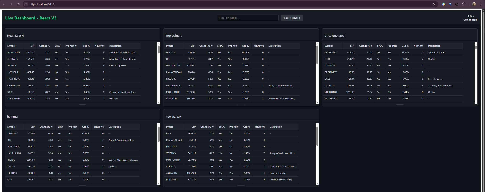

# Live Trading Dashboard V3 - React Edition

Welcome to the latest version of the Live Trading Dashboard, now powered by a modern React frontend and a robust Python backend. This application provides real-time stock data visualization, grouped by trading strategies.



## 🚀 Features

*   **Real-Time Data:** Live stock data is streamed directly to the dashboard using WebSockets for instant updates.
*   **Strategy-Based Grouping:** Stocks are automatically categorized into cards based on pre-defined trading strategies (e.g., "Near 52 WH", "Top Gainers").
*   **Interactive UI:**
    *   Sort stocks within any strategy card by clicking on column headers (Symbol, LTP, Change %, etc.).
    *   Filter all stocks by symbol using the search bar in the header.
    *   Resize strategy cards vertically to customize your view.
    *   Reset the layout to its default state with a single click.
*   **Dynamic Backend:** The Python (Flask) backend intelligently loads the latest daily trading data and connects to the Fyers WebSocket for live price feeds.
*   **Modular Project Structure:** The codebase is now cleanly separated into a `frontend` (React/TypeScript) and `backend` (Python/Flask) directory for better maintainability.

## Project Structure

```
alive_V2/
├── backend/                # Python Flask server and data logic
│   ├── run_optimized_dashboard_v2.py # Main launcher script
│   └── optimized_flask_server_v2.py  # Flask-SocketIO server
├── frontend/               # React frontend application
│   └── trading-dashboard/
│       ├── src/
│       │   └── App.tsx     # Main React component
│       └── ...
└── README.md               # You are here!
```

## 🛠️ How to Run

### 1. Backend Setup

First, ensure you have the required Python packages. The launcher script will attempt to install them automatically.

1.  **Navigate to the backend directory:**
    ```bash
    cd backend
    ```
2.  **Add Fyers API Token (Optional):** If you want to connect to the live Fyers data feed, place your access token in a file named `fyers_token.txt` within the `backend` directory. If this file is not present, the application will run with mock data.
3.  **Run the application:**
    ```bash
    python run_optimized_dashboard_v2.py
    ```
    This will start the backend server, typically on `http://localhost:5000`.

### 2. Frontend Setup

The frontend is a standard Vite + React application.

1.  **Navigate to the frontend directory:**
    ```bash
    cd frontend/trading-dashboard
    ```
2.  **Install dependencies:**
    ```bash
    npm install
    ```
3.  **Start the development server:**
    ```bash
    npm run dev
    ```
    The frontend will be accessible at the URL provided by Vite (usually `http://localhost:5173`).

---

*This project is for educational and demonstrational purposes only.* 